# Microsoft-Azure
Azure features

## Core Azure Services - Storage:
 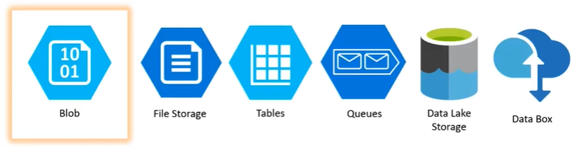
#### Bolb:
*   Azure Bolg Storage is a service for storing large amounts of unstructured object data, such as text or binary data. Common uses of Blob Storage include: Serving  images or documents directly to a browser. Storing files for distributed access.Streaming video and audio.

#### File Storage:
*   Azure Files offers fully managed file shares in the cloud that are accessible via the industry standard `Server Message Block (SMB)` prototcol. Azure file shares can be mounted concurrently by cloud or on-premises deployments of Windows, Linux and MacOS.
    *  Ex: Supose if we are having a file to edit in our application, Then when you run the application it might be using 4th Server out of 5 servers (load balancer - randomly assinging the servers based on the traffic), Now what we edit in 4th Server, it should reflect in all other servers with the udpated file changes. Here it requires Centeral File storage system we use here to SYNC the data accross the servers is `Server Message Block (SMB)` prototcol.

#### Tables:
*  Azure Table stores large amounts if structred data. The service is a NoSQL datastore which accepts authenticated calls from inside and outside the Azure cloud. Azure tables are ideal for storing structred, non-relational data.

#### Queues:
* Azure Queues storge is a service for storing large numbers of messages that can be accessed from anywhere in the world via authenticated calls using HTTP or HTTPS. A single queue message can be up to 64KB in size, and a queue can contain millions of messages, up to the total capacity limit of a storage account.

#### Data lake Storage
*   Azure Data lake Storage is an enterprise-wide hyper-scale repository for Big Data analytics workloads. Azure Data Lake enables you to capture data of any size, type and ingeestion speed in 1 single place for operational and exploratory analytics. 

#### Data Box
*   Azure Data Box - Move stored or in-flight data ot Azure quickly and cost-effectively: Data Box offline devices easily move data to Azure when busy networks are not an option. Data Box online appliances transfer data to and from Azure over the network.

###### Hands-On Azure Bolg Storage

 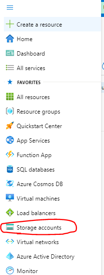
 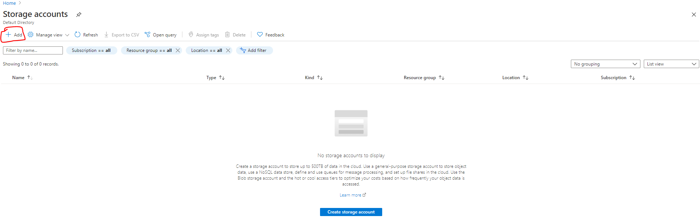
 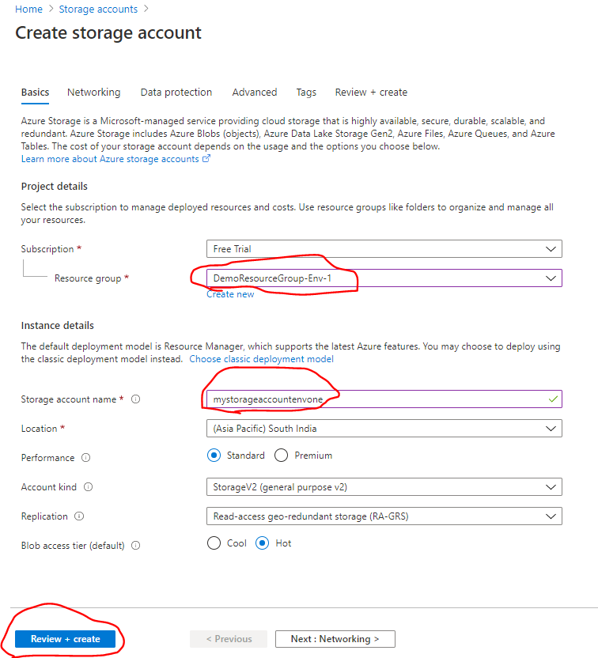
 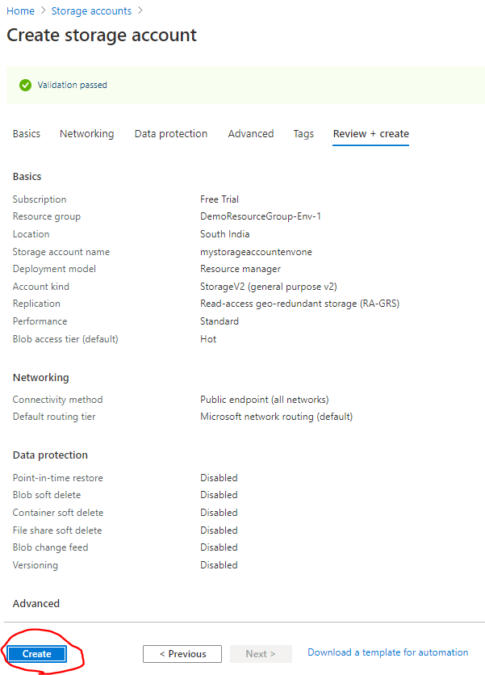
 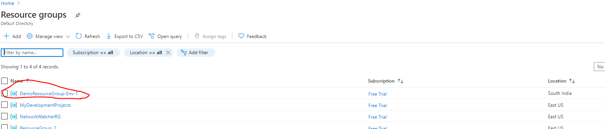
 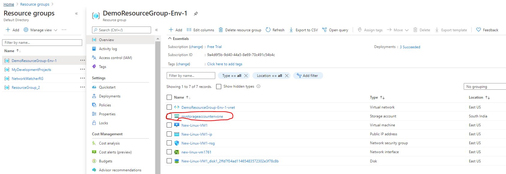
 -  Here Container are kind of Root folders for Blogs. Create a container and inside upload the Blob files
 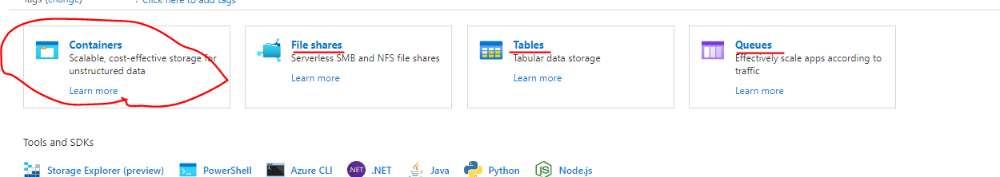
 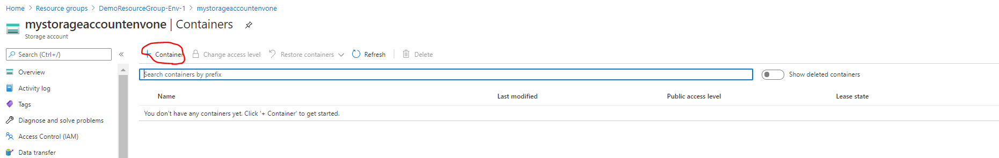
 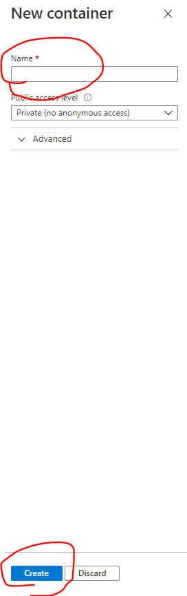
 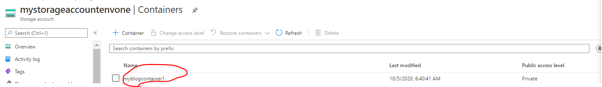
 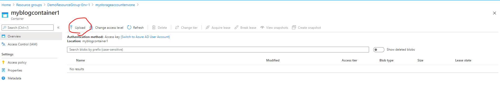
 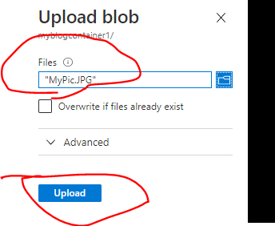
 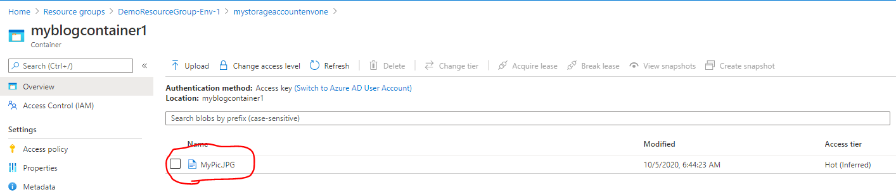
 -  Here you can choose the access type of the containers
 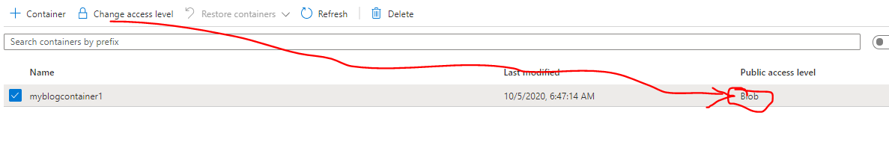
 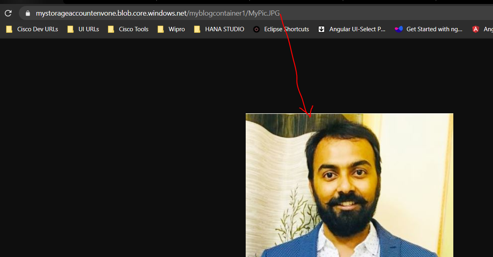

## Core Azure Services - Database + Analytics:
 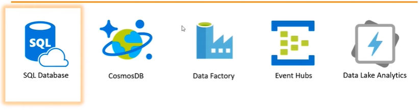

#### SQL Database:(PaaS):
* Azure SQL Database is an intelligent, scalable, cloud database service that provides the broadest SQL Server engine compatibilty and upto 212% return on investment.
* Azure SQL Database which is Database as a Service, do not get access to OS on which this Database is installed. Get only access to the DB paltform(PaaS Platform As A Service). 

#### CosmosDB:
*  Azure Cosmos DB is a fully managed DB service with turnkey global distribution and transperant multi-master replication. Get single-digit millisecond read and write latencies at the 99th percentile, automatic and elastic scaling of throghtput and storage.
*  If we launch the Cosmos DB cluster, it creates a replica of DataBase in multiple regions as we specify. We can enable / disable the DB replication on 1 click on the specific region.

#### Data Factory:
*   Azure Data Factory service is a fully managed service for composing data storage, processing, and movement services into streamlined, scalable, and reliable data production pipelines. 
*   It is basically ETL service (Abstract Transform & Load service) which basically takes data from multiple sources and tranform (Un Structured Data to Structured Data) data accordingly to coded in application.
*   Suppose if we have millions rows of data, its difficult to read all the data to understand/analyze, So we need to use BI (Busineess Intelligence) applications. It will quickly create the patterns or graphs etc.. which will help to analyze the data quickly.
* Data Factory helps to integrate lot of BI tools like `Power BI, Tablue, etc...`

#### Event Hubs:
*   Event Hubs is fully managed, real-time data ingestion service that is simple, trusted and scalable. Stream millions of events per second from any source to build dynamic data pipelines and immediately respond to business challenges.

#### Data Lake Analytics:
*   Azure Data Lake Analytics is a distributed, cloud-based data processing architecture offered by Microsoft in the Azure cloud. iT is based on YARN, the same as the open-soruce Hadoop platform. It pairs with Azure Data Lake store, a cloud-based storage platform designed for Big Data analytics.

## Core Azure Services - AI + Machine Learning:

 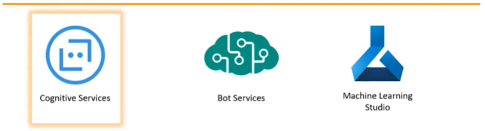

#### Cognitive Services:
*   Azure Cognitive Services are APIs, SDKs and Services available to help developers build intelligent applications without having direct AI or data science skills or knowledge. Azure Cognitive Services enable developers to easily add cognitive features into their applications.

#### Bot Services:
*   Azure Bot Services is Microsoft artficial intelligence (AI) chatbit offered as a service on the Azure cloud service marketplace. Azure Bot Services offers the ability to add intelligent agents that are capable of conversation without having to commit the resources to develop ones own AI.

#### Machine Learning Studio:
* Azure Machine Learning Studio us a collaborative, drag-and-drop tool you can use to build, test, and deploy predictive analytics solutions on your data. Machine Learning Studio publishes meodels as web services that can easily be consumed by custom apps or BI tools such as Excel.

## Core Azure Services - Identity:
 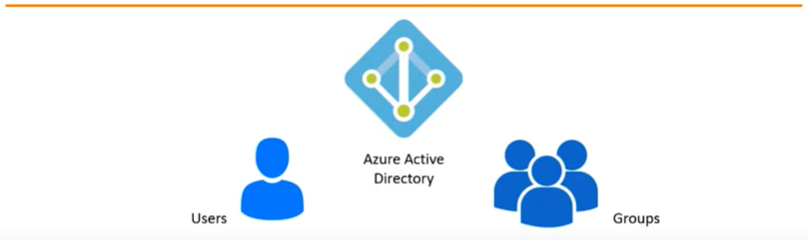

#### Azure Active Directive:
*   Azure Active Directive __`(aka Azure AD)`__ is a fully managed multi-tenant service from Microsoft that offers identity and access capabilities for applications running in Microsoft Azure and for applications running in an on-premises environment.

## Core Azure Services - Management:
 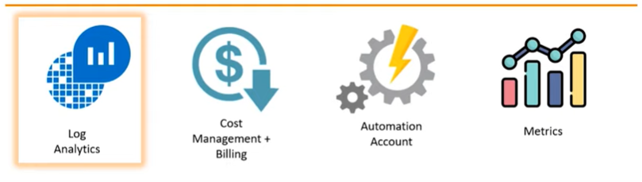

#### Log Analytics:
*   Log data collected by Azure Monitor is stored in a __`Log Analytics workspace`__, which is based on Azure Data Explorer. It collects telemetry from a variety of sorurces and uses the Kusto query language used by Data Explorer to retrieve and analyze data.

#### Cost Management + Billing:
*   Azure Cost Management is a native Azure cost Management solution. It helps you analyze costs, create and manage budgets, export datam and review and act ib optimization recomendations to save money.

#### Automation Account:
*   Azure Automation delivers a cloud-based automation and configuration service that provides consistent management across your Azure and non -Azure environments. It consists of process automation, update management, and configuration features.

#### Metrics:

