# Microsoft-Azure
Azure features

## Core Azure Services - Storage:
 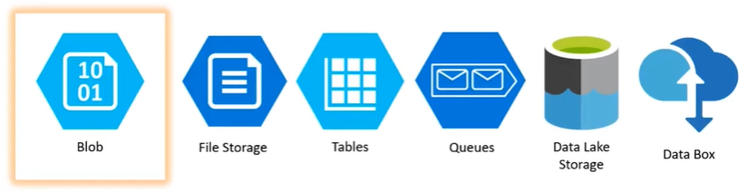
#### Bolb:
*   Azure Bolg Storage is a service for storing large amounts of unstructured object data, such as text or binary data. Common uses of Blob Storage include: Serving  images or documents directly to a browser. Storing files for distributed access.Streaming video and audio.

#### File Storage:
*   Azure Files offers fully managed file shares in the cloud that are accessible via the industry standard `Server Message Block (SMB)` prototcol. Azure file shares can be mounted concurrently by cloud or on-premises deployments of Windows, Linux and MacOS.
    *  Ex: Supose if we are having a file to edit in our application, Then when you run the application it might be using 4th Server out of 5 servers (load balancer - randomly assinging the servers based on the traffic), Now what we edit in 4th Server, it should reflect in all other servers with the udpated file changes. Here it requires Centeral File storage system we use here to SYNC the data accross the servers is `Server Message Block (SMB)` prototcol.

#### Tables:
*  Azure Table stores large amounts if structred data. The service is a NoSQL datastore which accepts authenticated calls from inside and outside the Azure cloud. Azure tables are ideal for storing structred, non-relational data.

#### Queues:
* Azure Queues storge is a service for storing large numbers of messages that can be accessed from anywhere in the world via authenticated calls using HTTP or HTTPS. A single queue message can be up to 64KB in size, and a queue can contain millions of messages, up to the total capacity limit of a storage account.

#### Data lake Storage
*   Azure Data lake Storage is an enterprise-wide hyper-scale repository for Big Data analytics workloads. Azure Data Lake enables you to capture data of any size, type and ingeestion speed in 1 single place for operational and exploratory analytics. 

#### Data Box
*   Azure Data Box - Move stored or in-flight data ot Azure quickly and cost-effectively: Data Box offline devices easily move data to Azure when busy networks are not an option. Data Box online appliances transfer data to and from Azure over the network.

###### Hands-On Azure Bolg Storage

 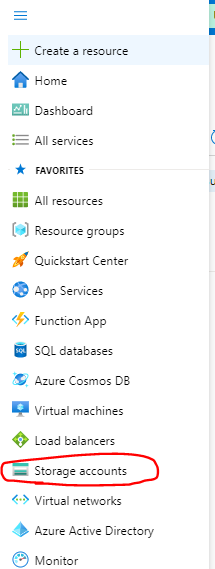
 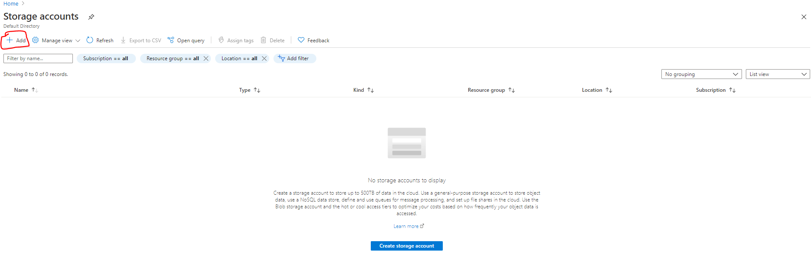
 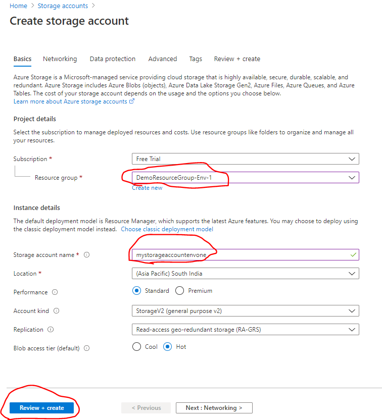
 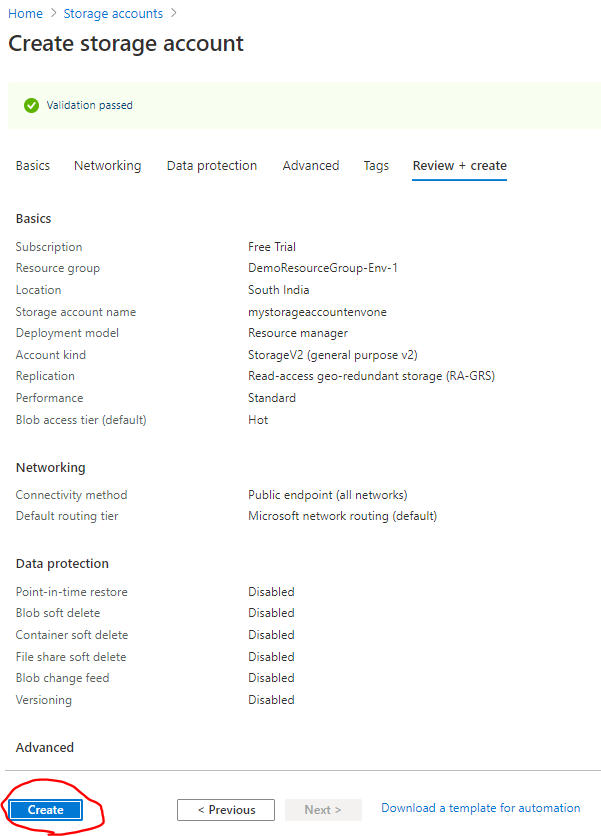
 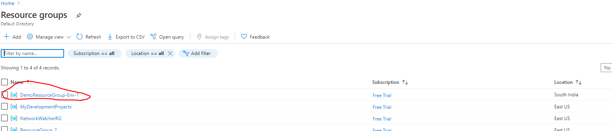
 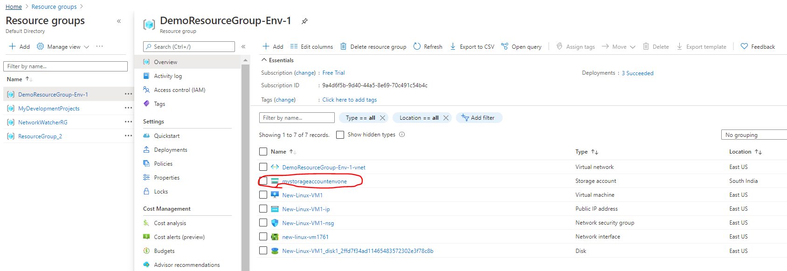
 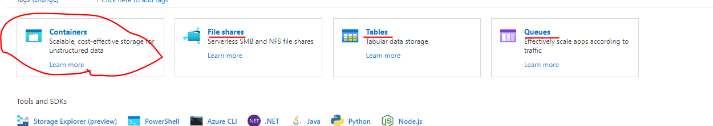
 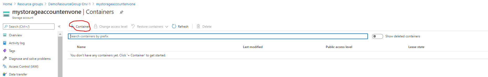
 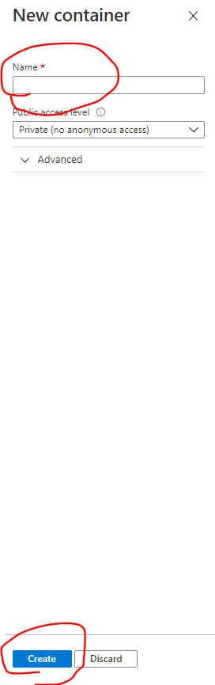
 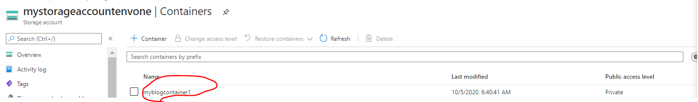
 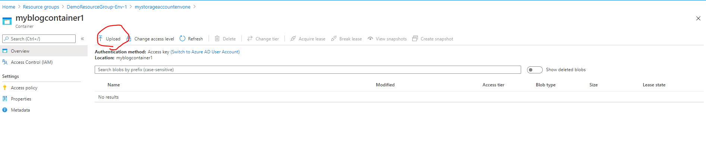
 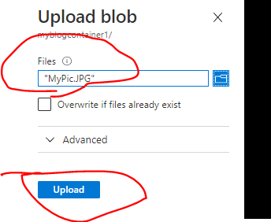
 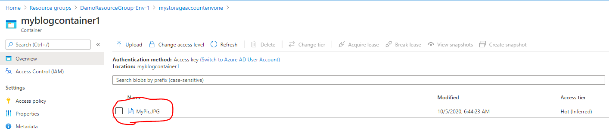
 
 
